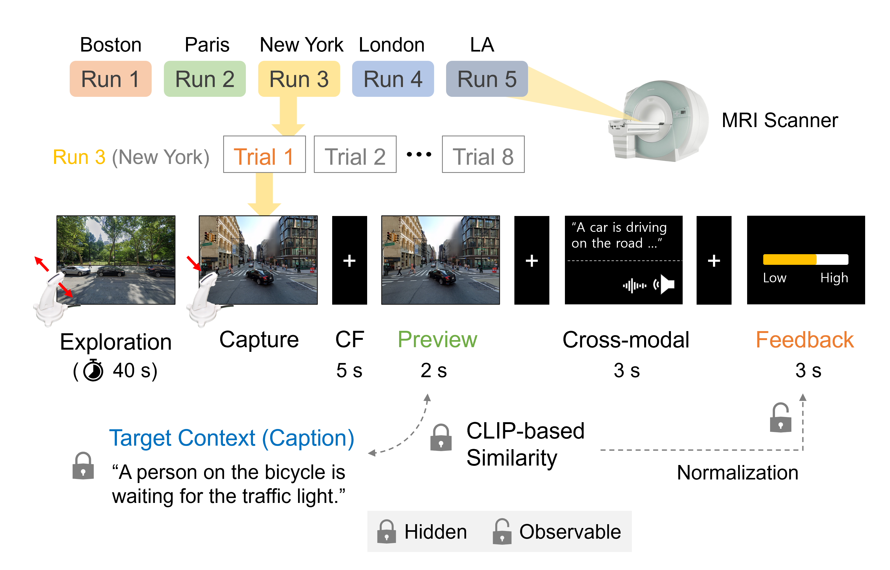

# Photographer Experimental Paradigm
A novel naturalisitc real-world reinforement learning (RL) paradigm in Google street-view environments. 

## Experimental paradigm


> [Example video](https://youtu.be/Q4SWYZAgP8o) of a single trial

## Hardwares
- `Presentation PC`: Windows 10/11 x64 (tested)
- `Joystick/Gamepad`: [Tethyx MR-compatible fMRI joystick](https://www.curdes.com/mainforp/responsedevices/hhsc-joy-5.html) (_Current Designs_, used in our experiment)
    - Note that any general Xbox gamepad (_Microsoft_) can be used for non-fMRI tasks
- `fMRI opto-electronic Interface`: [932 fORP Interface](https://www.curdes.com/fiu-932b.html) (_Current Designs_, used in our experiment)

## Usage
### Download the prebuilt binary
- [[Google Drive](https://drive.google.com/file/d/1k7KaDfDEnlaQNDnCpTePQaYa9NgGAnLz/view?usp=sharing)] Windows 10/11 x64 (64-bits)
- [[GitHub Release](https://github.com/constantjin/photographer-experimental-paradigm/releases/download/0.0.1/Photographer.Experimental.Paradigm-0.0.1-win.zip)] Windows 10/11 x64 (64-bits)
- Decompress the ZIP file (`Photographer Experimental Paradigm-0.0.1-win.zip`) and run `Photographer Experimental Paradigm.exe`.

### Build on your local computer (Windows 10/11 x64)
1. Install [Node.js](https://nodejs.org/en) >= 16.0.0 (currently tested on Node 20.11.0).
2. Install [git](https://git-scm.com/) and clone this repository:

    ```bash
    git clone https://github.com/constantjin/photographer-experimental-paradigm.git
    ```
    - Or you can directly download the source code ZIP file at the GitHub page (`<> Code` icon > `Download ZIP` menu) and decompress.
3. Install dependencies: 
    ```bash 
    npm install
    ```
4. Build the binary:
    ```bash
    npm run build
    ```
5. Move to `release/0.0.1/win-unpacked` directory and run `Photographer Experimental Paradigm.exe`.

### Preparation before the experiment
- Prepare the `experimental_settings.json` file
    - Before the participant registration, the paradigm requires to load experimental settings and CLIP models from a json file.
    - Therefore, rename `experimental_setting.json.example` in the project root as `experimental_setting.json` and modify experimental parameters by following the [Experimental settings](#experimental-settings) section below.

- Setup up the joystick/fMRI fORP interface and test them
    - For fMRI experiments, the MR-compatible joystick should be connected the presentation computer through fMRI interface. Please refer to the fMRI interface documentation ([example](https://wiki.curdes.com/bin/view/CdiDocs/932QuickSetup)) to correctly configure and calibrate the joystick.
    - For non-fMRI experiments, the presentation PC would automatically recognize the gamepad (i.e., Xbox controller) plug-and-play.
    - Regardless of fMRI or non-fMRI experiments, please test the connected joystick with [Gamepad Tester](https://hardwaretester.com/gamepad) site. 
        - For the Tethyx joystick, the values at the Axis0/1 panels should change if you move the analogue stick, and the B0 value should be 1 if you press the thumb button. 
        - For the Xbox controller, the Axis0/1 should correspond to the left analogue stick, and the B0 should respond to the A button.

- Setup the fMRI sync input
    - In our neuroimaging center, Syncbox (_NordicNeuroLab_) is configured to send `s` key inputs to the presentation PC if it receives signals from the MRI. Therefore, the sync page of this paradigm will respond to `s` key input to start the task run.
    - Therefore, please test the sync signal and check whether it sends `s` key input (e.g., using a text editor like Notepad) before the experiment.
    - If your Syncbox sends signals other than `s`, please update the keycode in `src/routes/Sync.tsx` (line 17, `event.code === "KeyS"`) and re-build the binary ([Build on your local computer](#build-on-your-local-computer-windows-1011-x64) section).
    - For non-fMRI experiments, just press `s` key at the sync page to start the task run.

- Change the screen resolution to `800 x 600`
    - The field-of-view of the street view and font sizes were pre-selected with respect to the 800 x 600 screen resolution.
    - Although it is not necessary, we recommend you to change the screen resolution to `800 x 600` (especially for the fMRI experiment).

### Participant registration
- After executing `Photographer Experimental Paradigm.exe`, you will see the registration page. Click `⚙️ Setting` > `Load Settings` and select your `experimental_setting.json` file. The paradigm would load the settings and CLIP models.

    - If you see `JSON parse error`, then the JSON file is misconfigured. Press `Ctrl` + `Shfit` + `i` (Windows) to open the DevTools, select the `Console` panel, and check misconfigured keys in the JSON file.
    - If CLIP models are not loaded, you will see the `❌ Unloaded` message at the `📎 CLIP` section. It is likely that the `clipTextModelPath` or `clipImageModelPath` is misconfigured. Open the `Console` panel in DevTools and check the model paths.

- You can check the joystick/gamepad connection status at the `🕹️ Controller` panel. Move the joystick. The `❌ Disconnected` message will change to `✔️ Connected` if the joystick is correctly configured.

- If the setting file and CLIP models are loaded, you can register a participant by filling in the Name/ID and clicking the `Register / Load the pariticipant` button. If this is the first run, the paradigm will create a participant data directory in the path specified in `experimentalDataStore` key. If the data directory has been created before (i.e., not the first run), it will automatically compute the next run number and start that run.

- After successful registration, you can start the experiment by pressing the `Start Experiment` button. Enter full screen at the sync page by pressing `F11`.

### Control
- You can change your viewpoints (or 'rotate') by moving the joystick (or left analogue stick) to the `left` and `right` direction.

- There are 'arrows' pointing new locations in the street view. Move the joystick `up`, then you will move to the new location following the arrow closest to your heading direction. If you move the joystick `down`, you will move to the previous location.

- You can capture the current scene by pressing the `thumb button` (or `A` button in gamepads). Note that the paradigm automatically captures the scene after `trialInfo.captureIntervalInMs` (default: 40000 ms or 40 s).

## Experimental settings
Guides and explanations for keys in `experimental_setting.json.example` file. Note that **all keys are required** for the paradigm.

| Key | Type | Details | Default
| --- | ---- | ------- | -------
| googleMapsAPIKey | `string` | API key for Google Maps JavaScript API. You can issue a new API key following [this guide](https://developers.google.com/maps/documentation/javascript/get-api-key). | |
| azureAPIUrl | `string` | Azure AI Vision, Analyze API endpoint URL. For example, `https://[your-project-name].cognitiveservices.azure.com/vision/v3.1/analyze?visualFeatures=Description`. You can get your endpoint URL and key after [creating a Vision resource](https://portal.azure.com/#create/Microsoft.CognitiveServicesComputerVision) in Azure Portal. | |
| azureAPIKey | `string` | Azure AI Vision, Analyze API endpoint key. | |
| googleTTSAPIKey | `string` | API key for Google Text-To-Speech (TTS) API. You can setup a TTS project following [this guide](https://cloud.google.com/text-to-speech/docs/before-you-begin) and get a API key at the Google Cloud Console. | |
| clipTextModelPath | `string` | Path for the CLIP Text encoder model. You can download the model from this [HuggingFace 🤗 repo](https://huggingface.co/rocca/openai-clip-js/tree/main). We used `clip-text-vit-32-float32-int32.onnx`. We recommend using abstract paths for the settings. | |
| clipImageModelPath | `string` | Path for the CLIP Image encoder model. We used `clip-image-vit-32-float32.onnx`. | |
| experimentalDataStorePath | `string` | Path for the experimental data. All participant directories/data would be created and stored in this path. | |
| runInfo | `RunInfo[]` | Array containing the city information and target caption text used in the experiments. Participants will visit each city in each run (in a pseudo-random order). Therefore, the lengh of `runInfo` array equals to the total number of runs. See below for each key in a `RunInfo` object. | |
| runInfo.city | `string` | Name of a city. We used "Boston", "New York", "Los Angeles", "London", and "Paris". | |
| runInfo.latlng | `{ lat: number; lng: number }` | Latitude and longitude of the initial starting point. We used coordinates of the City Hall for each city. | |
| runInfo.captionText | `string` | Target context (caption) for the city. We used the same sentence ("A person on the bicycle is waiting for the traffic light.") for all cities/runs. ||
| trialInfo | `TrialInfo` | Constants for all trial events (i.e., Exploration, Preview, Cross-modal, Feedback, and Cross-fixation). See below for details. | |
| trialInfo.totalNumberOfTrials | `number` | Total number of trials (or 'capture attempts') in a run. We used 8 trials. | 8 |
| trialInfo.captureIntervalInMs | `number` | Maximum exploration time in milliseconds for the Exploration phase. After that, the paradigm automatically captures (annotated as 'capture_failed') the scene and move to the next event. We set 40 s (40000 ms) for the exploration time. | 40000 |
| trialInfo.fixationDurationInMs | `number` | Base duration for cross-fixations between events. We used 5 s (5000 ms). | 5000 |
| trialInfo.fixationJitterRatio | `number` | Percentage of random jittering for cross-fixation durations. Each cross-fixation is shown for a (pseudo) random duration between `(1 - fixationJitterRatio) * fixationDurationInMs` and `(1 + fixationJitterRatio) * fixationDurationInMs`. We used 20% jittering. | 0.2 |
| trialInfo.capturePreviewDurationInMs | `number` | Duration for the Preview block. Default 2 s (2000 ms). | 2000 |
| trialInfo.multimodalDurationInMs | `number` | Duration for the Cross-Modal (Multimodal) event block. Default is 3 s (3000 ms). | 3000 |
| trialInfo.propabilityOfCaptionText| `number` | Probability of presenting a caption text (generated using Azure Vision API) than a TTS voice in the Cross-Modal block (default: 50%). | 0.5 |
| trialInfo.speakingRate | `number` | Speaking speed of TTS voices generated using Google TTS API. Larger values lead to faster speaking. We used 1.2 (20% faster than default).  | 1.2 |
| trialInfo.rewardDurationInMs | `number` | Duration of the Feedback (Reward) block. Default 2 s (2000 ms). | 2000 |
| trialInfo.minSimilarityThreshold | `number` | Minimal cosine similarity score used in feedback score computation. All cosine similarity scores less than this (default: 0.18) are presented as 0 feedback scores. | 0.18 |
| trialInfo.maxSimilarityThreshold | `number` | Maximum consine similarity score for feedback score computation (default: 0.28). Presented feedback scores are normalized as `(cosineSimilarityScore - minSimilarityThreshold) / (maxSimilarityThreshold - minSimilarityThreshold) * 100`. | 0.28 |